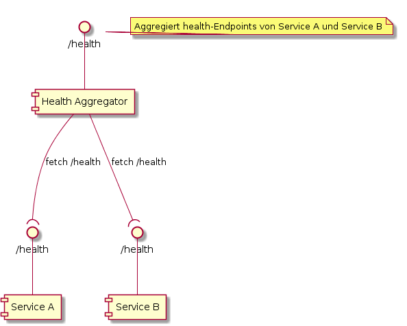
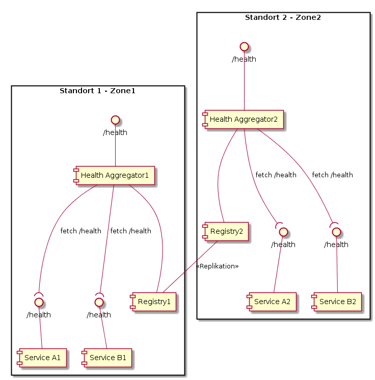

#  health-actuator-aggregator

Library, welche die `/health` Endpoints von mehreren Systemen zusammenzieht und im `/health` Endpoint des aktuellen Systems darstellt.

> Nur für Projekte Referenzarchitektur 4, sollte __nicht__ für Projekte mit Referenzarchitektur 5 (PaaS/Kubernetes) verwendet werden


### Hintergrund

In der Referenzarchitektur 4 ist vorgesehen, Anwendungen aus mehreren Spring Boot Containern zu erstellen.
Diese Container behandeln dabei je einen separaten Aspekt des Gesamtsystems und sind lose über eine ServiceRegistry gekoppelt.   

### Dependencies

Diese Library hat neben der Abhängigkeit auf `spring-boot-actuator` auch eine Abhängigkeit auf `spring-cloud-starter-eureka`. Beide Abhängigkeiten werden transitiv nachgezogen.

### Übersicht



Im Rahmen einer Spring Cloud Applikation wird ein Spring Boot Container als Health Aggregator bestimmt. Auf dessen /health-Endpoint wird mit Hilfe dieser Library die Health-Informationen der anderen Services integriert.

### Verwendung 

Um den health-actuator-aggregator zu aktivieren, muss zuerst diese Library als dependency konfiguriert werden:

```xml
[...]
<dependency>
    <groupId>ejpd-spring-servicecheck</groupId>
    <artifactId>health-actuator-aggregator</artifactId>
    <version>0.1-SNAPSHOT</version>
</dependency>
[...]

```

Danach muss die Spring-Boot Applikation mit `@EnableServicesHealthAggregation` annotiert werden, damit der health aggregator aktiv wird:

```java
@SpringBootApplication
@EnableDiscoveryClient
@EnableServicesHealthAggregation
public class SomeSpringBootApp {
     public static void main(String[] args) {
            new SpringApplicationBuilder(SomeSpringBootApp.class)
                    .run(args);
        }
}

```


### Anzeige im Health-Endpoint

##### Hierarchie

Der health aggregator fügt dem eigentlichen /health- Endoint ein neues Objekt names "aggregatedServices" hinzu. AggregatedServices besteht aus einem Unter-Objekt pro Service, welcher überwacht werden soll. 

Dieses Service-Objekt besteht wiederum aus je einem Unter-Objekt pro Service-Instanz. 

Dieses Serivce-Instanz-Objekt beinhaltet die healthCheckURL der Instanz, sowie eine komplette Kopie der gesamten Health-Informationen der entsprechenden Instanz.

Die gesamte Hierarchie sieht also wie folgt aus:


* aggregatedServices
    * SERVICE_A
        * instance-0
    * SERVICE_B
        * instance-0
        * instance-1
        
In diesem Beispiel werden SERVICE_A und SERVICE_B überwacht, wobei ersterer eine, letzterer 2 Instanzen hat. 

##### Propagieren des Status

Ohne weitere Konfiguration (siehe Abschnitt Konfiguration) wird der Status wie folgt propagiert:

1. Eine Service-Instanz hat den Status, welcher vom /health Endpoint der Instanz zurückgegeben worden ist.
2. Ein Service hat den Status wie im Kapitel `Mindestanzahl Instanzen / Service` erklärt: UP wenn alle Instanzen UP sind, DOWN wenn alle Instanzen DOWN (oder keine verfügbar) sind, sonst WARNING.
3. aggregatedServices hat ohne weitere Konfiguration den schlimmsten Status aller Services. Damit hat dieser Abschnitt dasselbe Verhalten wie der [OrderedHealthAggregator](https://github.com/spring-projects/spring-boot/blob/v1.5.6.RELEASE/spring-boot-actuator/src/main/java/org/springframework/boot/actuate/health/OrderedHealthAggregator.java),
welcher Spring Boot per Default verwendet, um den Gesamtstatus aus allen Komponenten zu errechnen. 
            
##### Eigener AggregatedServices-Status

Um den Gesamtstatus der Applikation zu übersteuern kann ein Spring-Bean erstellt werden, welches das Interface [ApplicationStatusAggregator](.src/main/java/ch/ejpd/servicecheck/actuatoraggregation/health/ApplicationStatusAggregator.java) implementiert. 

Ein Beispiel:

```java
import ch.ejpd.servicecheck.actuatoraggregation.health.ApplicationStatusHealthAggregator;

@Component
public class MyApplicationStatusAggregator implements ApplicationStatusHealthAggregatorAggregator { 
    
    @Override
    Status aggregateApplicationStatus(Map<String, Health> servicesStatus) {
        [...]
    }


}
```

Die per default verwendete Implementation des Application [ApplicationStatusAggregator](.src/main/java/ch/ejpd/servicecheck/actuatoraggregation/health/ApplicationStatusAggregator.java) verwendet einen [OrderedHealthAggregator](https://github.com/spring-projects/spring-boot/blob/v1.5.6.RELEASE/spring-boot-actuator/src/main/java/org/springframework/boot/actuate/health/OrderedHealthAggregator.java) 
mit den Status 

* DOWN
* OUT_OF_SERVICE
* WARNING
* UP
* UNKNOWN

Wenn nur diese Reihenfolge angepasst werden soll kann dies auch über die Konfiguration erfolgen. Zum Beispiel: 

```yml
management:
  health:
    status:
      order: DOWN, WARNING, UP
```
  


### Konfiguration 

##### Service-Liste

Da der health aggregator die Informationen zu den konkreten Service-Instanzen aus einer Service-Registry bezieht, muss die Spring-Boot-Applikation, 
welche die Aggregierung machen soll, natürlich korrekt als DiscoveryClient konfiguriert sein. Als Beispiel dafür kann [example-spring-cloud](https://repo.isc-ejpd.admin.ch/stash/projects/EXAMPLES/repos/example-spring-cloud/browse) dienen.  

Um die Health-Information der Services zu integrieren ist es ausserdem nötig, die Service-Namen als Liste zu konfigurieren. Ohne diese Konfiguration kann der health aggregator allfällige Services, 
zu welchen es keine aktiven Instanzen gibt, nicht identifizieren und somit keine Aussage machen, ob das Gesamtsystem gesund ist.

Dazu definiert man in der Spring Boot Konfiguration (z.B. application.yml) folgendes:

```yml
healthaggregator:
  neededServices:
    DATABASE-SERVICE: 1
    BATCH-SERVICE: 2
    APPLICATION-EDGE-SERVICE: 1
    CACHE-SERVICE: 3
```


Die Zahlen nach dem Service-Name entsprechen der Anzahl Instanzen, welche pro Service benötigt sind.

##### Mindestanzahl Instanzen / Service

Der Status eines Services setzt sich aus den Status seiner Instanzen zusammen. Ohne weitere Anpassung gelten hierfür die folgenden Regeln:

* Wenn alle benötigten Instanzen UP sind, ist der Service UP. 
* Wenn 0 Instanzen DOWN sind, ist der Service DOWN.
* Ansonsten hat der Service den Status WARNING. 

In manchen Fällen ist es Sinnvoll, diesen Mechanismus zu übersteuern. Gründe dafür können sein:

- Ein bestimmter Service ist überhaupt nicht wichtig für das Gesamtsystem, und ein Ausfall aller Instanzen ist nicht weiter schlimm.
- Ein Service braucht mindestens n gesunde Instanzen, damit die User Experience nicht furchtbar schlecht wird.

Um solche Fälle abzudecken kann ein Bean zur Verfügung gestellt werden, welches [ServiceStatusAggregator](.src/main/java/ch/ejpd/servicecheck/actuatoraggregation/health/ServiceStatusAggregator.java) implementiert. 

Ein Beispiel:

```java
@Component
public class MyServiceStatusAggregator implements ServiceStatusAggregator { 
    
    @Override
    public Status aggregateServiceStatus(NeededService neededService, List<Status> status) {
        [...]
    }

}
```

Der Parameter neededService kapselt den Service-Namen und die benötigte Anzahl Instanzen aus der Konfiguration. Die 
Liste der Instanz-Status beinhaltet die Status der einzelnen Instanzen.  


##### Standortübergreifende Applikationnen - Registry Zone

Der Health Aggregator liest nur Services aus, welche in derselben Zone liegen wie er selbst. Wenn nun eine Applikation auf 2 Standorten verteilt ist, werden Service-Instanzen einer anderen Zone ignoriert, selbst wenn die Service-Registry repliziert ist und die anderen Instanzen sichtbar wären.
 




Die Zone, für welche der Health Aggregator zuständig ist, wird mit dem Property `eureka.instance.metadataMap.zone` festgelegt:

```yml
eureka;
  instance:
    metadataMap:
      zone: Zone1
```
Um zu entscheiden, ob eine zu prüfende Service-Instanz in derselben Zone ist wie der HealthAggregator selbst, wird die Metadata-Map der Service-Instanz ausgewertet und das Property "zone" ausgelesen. Die Services müssen also **genau gleich** konfiguriert sein (also auch einen Eintrag "zone" in der metadataMap haben) wie der HealthAggregator. 


Mit dem Property  `healthaggregator.registryzone` kann die Zone übersteuert werden: übersteuert werden:
 
 ```yml
 eureka;
   instance:
     metadataMap:
       zone: Zone1
 healthaggregator:
   registryzone: EineAndereZone      
 ```

##### HTTP Settings

Der health-actuator-aggregator verwendet ein `RestTemplate`, um die Health-Endpoints der Service-Instanzen abzuholen. Für diese ausgehende Kommunikation stehen die folgenden Konfigurationen zur Verfügung:

- Connection Timeout
- Read Timeout

Die Konfiguration der Timeouts ist optional. Per default wird von einem Connect- und Read-Timeout von **500 Millisekunden** ausgegangen.
Die Timeouts können sowohl global (für alle Services) als auch per Service-Instanz konfiguriert werden:

```yml
healthaggregator:
  http:
    default-read-timeout-milliseconds: 200
    default-connection-timeout-milliseconds: 200
    services:
      FOO:
        read-timeout-milliseconds: 1100
        connection-timeout-milliseconds: 800
```

Für Services, welche keine spezifischen Timeouts konfiguriert haben, gelten die Properties `default-read-timeout-millliseconds` resp. `default-connection-timeout-milliseconds`.

##### Weiterführende Konfiguration des Http-Clients

Der health-actuator-aggregator verwendet intern den Spring Boot `RestTemplateBuilder`, um die Health-Informationen aus den Service-Instanzen zu lesen. 
Pro konfigurierten Service wird aus dem `RestTemplateBuilder` ein `RestTemplate` ertstellt, welches den Http-Call durchführt. 

Sollte es nötig sein, weitergehende Konfigurationen für den health-actuator-aggregator vorzunehmen, können Applikationen ein Bean bereitstellen, welches in die Konfiguration des `RestTemplateBuilder` eingreiffen kann. 
Dieses Bean ist vom Typ `HealthAggregatorRestTemplateBuilderConfigurer`. Das folgende Beispiel registriert einen Interceptor:

```java
@Bean
HealthAggregatorRestTemplateBuilderConfigurer healthAggregatorRestTemplateBuilderConfigurer() {
    return restTemplateBuilder -> restTemplateBuilder.interceptors(new MyInterceptor());
}

```

Allfällige `HealthAggregatorRestTemplateBuilderConfigurer` werden berücksichtigt **BEVOR** die Timeout-Konfigurationen im obigen Kapitel konfiguriert werden. 
Dadurch kann es sein, dass ein Setzen von Connecton- und Read-Timeouts mittels `HealthAggregatorRestTemplateBuilderConfigurer` keinen Effekt haben.


